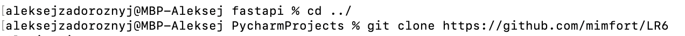
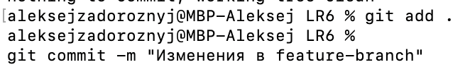
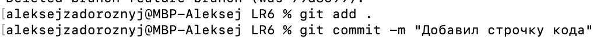

# LR6
Лабораторная работа №6


# Последовательность действий
1. Настройка git


2. Клонирование репозитория



3. Добавил файл через интерфейс Github


4. Подтягиваю изменения


5. Получаем историю коммитов


6. Смотрим последние изменения 


7. Создаю ветку feature-branch


8. Изменяю наполнение 


9. Перехожу в ветку master


10. Выполняю слияние


11. Удаляю ветку


12. Обновил код, сделал коммит


13. Отменяю последний коммит


14. Перехожу в новую ветку для выгрузки README.md


15. Достал историю

```bash
git log --pretty=format:"%h %ad | %s%d [%an]" --date=short
```

## git log

```text

9a61b5d 2024-11-14 | Добавил README (HEAD -> report, origin/report) [4319 Задорожный А.В]
be1faac 2024-11-14 | Добавил изображение [4319 Задорожный А.В]
79d8699 2024-11-14 | Изменения в feature-branch (master) [4319 Задорожный А.В]
0bf51de 2024-11-14 | Add files via upload (origin/master, origin/HEAD) [Alexey]
921f53b 2020-11-21 | Обновление информации [Kurtyanik]
c08a654 2020-11-21 | Файл создан пустым [Kurtyanik]
3c6e913 2020-11-21 | Initial commit [Kurtyanik]
```
